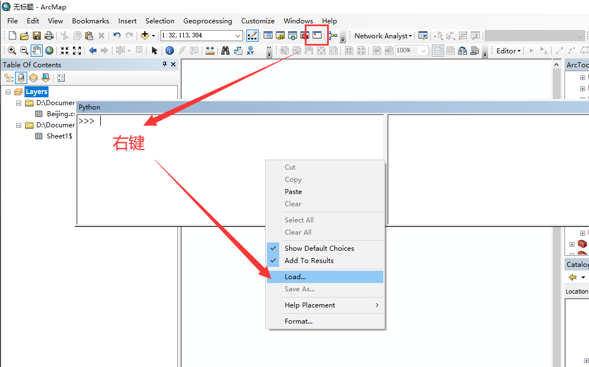
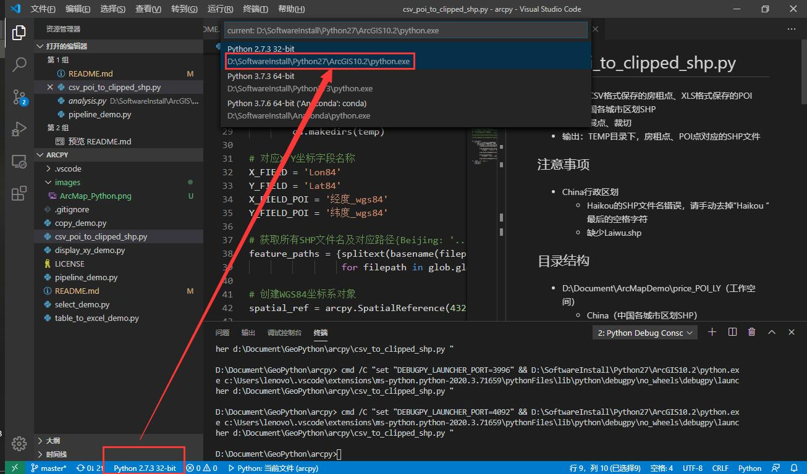

# csv_poi_to_clipped_shp.py
- 输入：CSV格式保存的房租点、XLS格式保存的POI点，中国各城市区划SHP
- 过程：展点、裁切
- 输出：TEMP目录下，房租点、POI点对应的SHP文件

## 注意事项
- China行政区划
    - Haikou的SHP文件名错误，请手动去掉“Haikou ”最后的空格字符
    - 缺少Laiwu.shp

## 目录结构
- D:\Document\ArcMapDemo\price_POI_LY（工作空间）
    - China（中国各城市区划SHP）
        - Beijing.shp
        - ...
    - POI（XLS格式保存的POI点）
        - Beijing
            - Agricul.xls
            - ...
        - ...
    - RentPrice_Jan（CSV格式保存的房租点）
        - Beijing.csv
        - ...
    - ResoldPrice_Jan（CSV格式保存的房租点）
        - Beijing.csv
        - ...
    - TEMP（输出目录）
        - POI
        - RentPrice_Jan
        - ResoldPrice_Jan

## 使用方法
### 共同点
- 修改WORKSPACE参数以定位文件路径
### 方法一：在ArcMap中使用
- 打开ArcMap，载入脚本

- 使用鼠标移动光标，修改WORKSPACE参数
- 将光标移到最后一行，回车运行

## 方法二：在Python IDE中使用
- 打开Python IDE，如VS Code
- 打开脚本，修改为ArcGIS所安装的Python2.7环境

- 同样，修改WORKSPACE参数
- 右键，在终端中运行。或点击右上角绿色三角
- 注意：如果未安装Python拓展，在打开py脚本文件的时候会提示安装。

## 参数说明
### WORKSPACE
> 一般而言，只用设置这个参数即可。即目录结构中对应的工作空间

### TEMP
> 输出目录名称